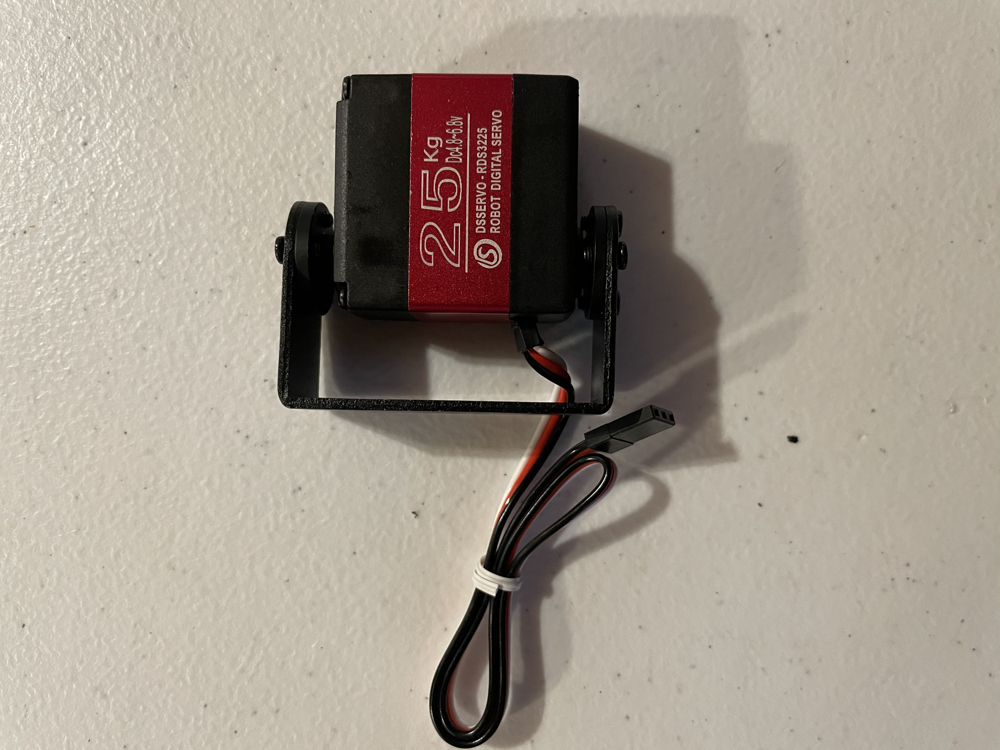

# RobotArm
## Quick links - 
* ### [First entry - 2/21/21](#Week1)
* ### [Second entry - 2/22/21](#Week2)

# Note: examples lacking. provide inspiration. look at trebuchet pumpkin chuckers and other robotic arms
---
## Project Planning
1) Create your question:

        a) What’s the problem you’re trying to solve?
            Some people are too lazy to go outside and play with their dog or they are incapable of doing so. 
            
        b) How will you determine if you’ve solved your problem?  (make sure your problem is specific and testable!)
            We will have constructed a working robot arm that is capable of throwing a ball at a set distance. 
            
2) Break down your problem:

    a) Criteria (goals):
    
        i) How does it solve the problem?
            It solves the problem by throwing a ball set distances. The distances can be changed manually.
            
        ii) What is it going to do?
            It is going to throw the ball using servos and different joints.

    b) Constraints (limitations)
    
        i) Don’t hurt anyone
        
        ii) Budget:
            Ideally $0. 
            
        iii) Time frame (roughly 2 months)
            Roughly 2 months.
            
        iv) Size (laser cutter: 300mm x 600mm , 3d Printer 8”x8”x9”)
            Size laser cutter 300mm x 600mm, 3d Printer 8”x8”x9”
            
        v) Any knowledge limitations that you’ll need to correct?
            no. our knowledge is infinite. (This is a joke, there will be obstacles we encounter that we may not know the answer to.)

## PseudoCode

Move servo back and forth
startup the servo
button stuff if we want to use button
import board
import time
import pulseio # Not sure if this is needed
import servo
import touchio # if we want to use capacitive touch. If not we will just use buttons

int buttonPin1 - 9;
int buttonPin2 - 10;

pwm = pulseio.PWMOut(board.A3, duty_cycle=2 ** 15, frequency=50)

my_servo = servo.ContinousServo(pwm)

### Using touch for telling the robot arm to throw
touch_A1 = touchio.TouchIn(board.A1)

    # Use IF statements to determine if a button is being pressed
        
        # IF first button pressed, distance increase
        
        # IF second button pressed, distance decreases
    
    # Possible errors:
        # If ball does not release, how do we change that
            # Object being thrown will be important to figuring out this issue
            
    # Use IF statements to determine if the capacitive touch wire is being touched
        # IF wire is touched, arm moves and throws the ball.
        
    # How do we stop the servo? Will need to find a way to stop it if something gets caught in it because it makes loud, annoying noises.
    # Maybe we make it self-destruct for laughs.
    
# [Link to onshape](https://cvilleschools.onshape.com/documents/bfcc8641be00469b99913a23/w/555fef59cc0d17192df0b7e0/e/882c596853e85d5789769ae8)
#### Lucas was unable to find the particular servo that we will be using for our project within OnShape, so instead he created our prototype to as closely resemble our final product as possible. 

---

# Week1
## 2/12/21
## Further planning and research -

* Picked up a 25kg digital servo motor       
* Continued OnShape work
* Furthered our knowledge with the coding aspect of the project
* Next step is to work on programming the motor and determing the angular velocity and acceleration to make sure it will meet the requirements to throw a ball.
* Will make a prototype base and arm
        
       
 

---

# Week2
## 2.22.21
## Progress made - 

* Purchased a servo controller to mess with the servo without having to use code. This speeds up the testing and debugging process
* Determined that the use of 2 servos would be necessary in order to throw the ball at least 15 feet using calculus and angular momentum and force laws.
* Used angular velocity to determine the horizontal displacement of the ball using the length of the arm, rotation speed, and the velocity of the arm at the launch point.
* Purchased additional servo
* Began prototyping arms
* Determined the velocity and timing of second servo for optimal launch velocity and angle using calculus and force laws.

---

# [BACK TO TOP](#RobotArm)
