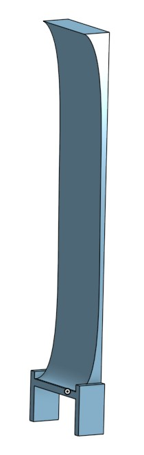

# RobotArm
## Quick links - 
* ### [First entry - 2/21/21](#Week1)
* ### [Second entry - 2/22/21](#Week2)
* ### [Third entry - 3/1//21](#Week3)
* ### [Fourth entry - 3/8/21](#Week4)
* ### [Fifth entry - 3/15/21](#Week5)
* ### [Sixth entry - 4/12/21](#Week6)
* ### [Seventh entry - 4/19/21](#Week7)
* ### [Eighth entry - 4/26/21](#Week8)
* ### [Link to onshape](https://cvilleschools.onshape.com/documents/bfcc8641be00469b99913a23/w/555fef59cc0d17192df0b7e0/e/882c596853e85d5789769ae8)

# Note: examples lacking. provide inspiration. look at trebuchet pumpkin chuckers and other robotic arms
---
## Project Planning
1) Create your question:

        a) What’s the problem you’re trying to solve?
            Some people are too lazy to go outside and play with their dog or they are incapable of doing so. 
            
        b) How will you determine if you’ve solved your problem?  (make sure your problem is specific and testable!)
            We will have constructed a working robot arm that is capable of throwing a ball at a set distance. 
            
2) Break down your problem:

    a) Criteria (goals):
    
        i) How does it solve the problem?
            It solves the problem by throwing a ball set distances. The distances can be changed manually.
            
        ii) What is it going to do?
            It is going to throw the ball using servos and different joints.

    b) Constraints (limitations)
    
        i) Don’t hurt anyone
        
        ii) Budget:
            Ideally $0. 
            
        iii) Time frame (roughly 2 months)
            Roughly 2 months.
            
        iv) Size (laser cutter: 300mm x 600mm , 3d Printer 8”x8”x9”)
            Size laser cutter 300mm x 600mm, 3d Printer 8”x8”x9”
            
        v) Any knowledge limitations that you’ll need to correct?
            no. our knowledge is infinite. (This is a joke, there will be obstacles we encounter that we may not know the answer to.)

## PseudoCode

Move servo back and forth
startup the servo
button stuff if we want to use button
import board
import time
import pulseio # Not sure if this is needed
import servo
import touchio # if we want to use capacitive touch. If not we will just use buttons

int buttonPin1 - 9;
int buttonPin2 - 10;

pwm = pulseio.PWMOut(board.A3, duty_cycle=2 ** 15, frequency=50)

my_servo = servo.ContinousServo(pwm)

### Using touch for telling the robot arm to throw
touch_A1 = touchio.TouchIn(board.A1)

    # Use IF statements to determine if a button is being pressed
        
        # IF first button pressed, distance increase
        
        # IF second button pressed, distance decreases
    
    # Possible errors:
        # If ball does not release, how do we change that
            # Object being thrown will be important to figuring out this issue
            
    # Use IF statements to determine if the capacitive touch wire is being touched
        # IF wire is touched, arm moves and throws the ball.
        
    # How do we stop the servo? Will need to find a way to stop it if something gets caught in it because it makes loud, annoying noises.
    # Maybe we make it self-destruct for laughs.
    
#### Lucas was unable to find the particular servo that we will be using for our project within OnShape, so instead he created our prototype to as closely resemble our final product as possible. 

---

# Week1
## 2.12.21
## Further planning and research -

* Picked up a 25kg digital servo motor       
* Continued OnShape work
* Furthered our knowledge with the coding aspect of the project
* Next step is to work on programming the motor and determing the angular velocity and acceleration to make sure it will meet the requirements to throw a ball.
* Will make a prototype base and arm
        
       
 

---

# Week2
## 2.22.21
## Progress made - 

* Purchased a [servo tester](https://www.amazon.com/gp/product/B07TQSKLBK/ref=ppx_yo_dt_b_asin_title_o01_s00?ie=UTF8&psc=1) to mess with the servo without having to use code. This speeds up the testing and debugging process
* Determined that the use of 2 servos would be necessary in order to throw the ball at least 15 feet using calculus and angular momentum and force laws.
* Used angular velocity to determine the horizontal displacement of the ball using the length of the arm, rotation speed, and the velocity of the arm at the launch point.
* Purchased additional servo
* Began prototyping arms
* Determined the velocity and timing of second servo for optimal launch velocity and angle using calculus and force laws.

                                                             
 

---

# Week3
## 3.1.21
## Progress made - 

* Received the [servo tester](https://www.amazon.com/gp/product/B07TQSKLBK/ref=ppx_yo_dt_b_asin_title_o01_s00?ie=UTF8&psc=1)
* Attached it to the servo arm and cut additional pieces of Sheetmetal for prototyping
* Began to format code and figure out how code works.
* We have planned to meet in person to work on our project, of course while abiding by COVID precautions, and hope to come close to creating a finished Robot Arm. 

 

## 3.3.21

* We congregated at William's house, while of course abiding by COVID precautions, to revise our arm.
* Programmed our arm to throw a set distance into a cup.
* Revised code and prototype to make sure this action was repeatable. 
* Spoke with Mr. H about how to improve our arm. 
---

# Week4
## 3.8.21
## Progress made - 

* We congregated at William's house again to continue working on our arm.
* Continued work on OnShape and Circuit Python.
* Mr. H gave us the idea to use a rotary encoder to make our project easier to use and less complicated for the user. 
* Using the rotary encoder, you can turn it the desired amount and click down on the switch to run the code. This allows us to complete the same functions that a potentiometer and button are able to complete with one switch as opposed to two. 

 
This is an image of the sport Jai Alai. The throwing arm used in the sport is the inspiration for the "hand" of our arm.

---

# Week5
## 3.15.21
## Progress made - 

* Met at William's house again on Wednesday, March 17th.
* Revised our GitHub and made sure it was up to date. 
* Wired and programmed LCD Screen and rotary encoder. 

# Week6
## 4.12.21
## Progress made -

* Today was the first day back in school since March 13th, 2020!
* Revised our OnShape to include the correct servo, as well as adding the appropriate mates in order to complete our prototype. 
* Decided to add counter weight to reduce stress on the servo.
*  

# Week7
## 4.19.21
## Progress made -

* Made revisions to our model on OnShape.
* We revised the legs, arms, and hand of our model. 
* In order to improve the structural integrity of our project, we made our legs extend further outward from the base of our arm, as well as lessen the distance from the bottom of our base to the top of our legs. 
* William revised our bottom arm to incorporate a slide that can hold a counterweight. The slide allows the counterweight move up and down to better reduce the stress on the servos. 
* The original model of our hand had an appearance similar to what we desired, but it did not accomplish the goal needed. We wanted our hand to curve, similar to that of a jai alai. To do so, we used the sweep feature, allowing us to extrude along a curved line and accomplish our goal of a curved hand. 
*   

  

# Week8
## 4.26.21
## Progress made -

* Made revisions to our OnShape model in order to make it lighter. 
* By hollowing out certain parts of our arms and legs, we reduced the amount of material that is going to be used to print our parts. 
* Since hollowing out the parts would reduce the structural integrity of our project, William thought of the idea to add beams to better bear the weight of our base. 

 

# [BACK TO TOP](#RobotArm)

